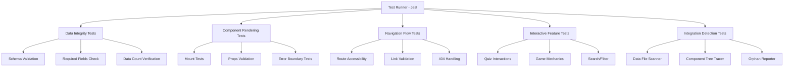

# Design Document: Hindi App Comprehensive Testing

## Overview

This design specifies a comprehensive programmatic testing system for the Hindi Mother Tongue English Learning application. The testing suite uses Jest with React Testing Library to validate data integrity, component rendering, navigation flows, interactive features, and integration completeness. The system identifies orphaned data files and components not linked to the main application flow.

## Architecture



## Components and Interfaces

### Test Utilities

```typescript
// tests/utils/dataValidator.ts
interface DataValidationResult {
  isValid: boolean;
  errors: ValidationError[];
  totalRecords: number;
  validRecords: number;
}

interface ValidationError {
  file: string;
  recordId: string | number;
  field: string;
  message: string;
}

interface DataFileIntegration {
  dataFile: string;
  exports: string[];
  importedBy: string[];
  isOrphaned: boolean;
}
```

### Component Integration Tracker

```typescript
// tests/utils/componentTracker.ts
interface ComponentNode {
  name: string;
  path: string;
  children: ComponentNode[];
  isReachable: boolean;
}

interface IntegrationReport {
  totalComponents: number;
  reachableComponents: number;
  orphanedComponents: string[];
  dataFileIntegrations: DataFileIntegration[];
}
```

### Test Configuration

```typescript
// tests/config/testConfig.ts
interface TestConfig {
  dataFiles: DataFileConfig[];
  pages: PageConfig[];
  components: ComponentConfig[];
}

interface DataFileConfig {
  path: string;
  requiredFields: string[];
  expectedMinCount: number;
}

interface PageConfig {
  route: string;
  component: string;
  expectedChildren: string[];
}
```

## Data Models

### Data File Schemas

```typescript
// Expected schema for hindiCommonPhrasesData.ts
interface CommonPhraseSchema {
  id: number;           // Required
  english: string;      // Required
  hindi: string;        // Required
  pronunciation: string; // Required
  usage: string;        // Required
  usageHindi: string;   // Required
  example: string;      // Required
  exampleHindi: string; // Required
  category: string;     // Required
  difficulty: 'beginner' | 'intermediate' | 'advanced'; // Required
  isFavorite?: boolean; // Optional
}

// Expected schema for hindiListeningData.ts
interface ListeningLessonSchema {
  id: number;           // Required
  title: string;        // Required
  titleHindi: string;   // Required
  audioText: string;    // Required
  audioTextHindi: string; // Required
  difficulty: 'beginner' | 'intermediate' | 'advanced'; // Required
  category: string;     // Required
  duration: string;     // Required
  questions: ListeningQuestion[]; // Required, min 1
}

// Expected schema for hindiRolePlayData.ts
interface RolePlayScenarioSchema {
  id: number;           // Required
  title: string;        // Required
  titleHindi: string;   // Required
  scenario: string;     // Required
  scenarioHindi: string; // Required
  category: string;     // Required
  difficulty: 'beginner' | 'intermediate' | 'advanced'; // Required
  dialogues: Dialogue[]; // Required, min 1
}

// Expected schema for hindiStoriesData.ts
interface StorySchema {
  id: number;           // Required
  title: string;        // Required
  content: string;      // Required
  vocabulary: VocabularyItem[]; // Required
  comprehensionQuestions: Question[]; // Required
}
```

### Integration Mapping

```typescript
// Data file to component mapping
const dataFileComponentMap = {
  'hindiCommonPhrasesData.ts': ['CommonPhrases.tsx'],
  'hindiListeningData.ts': ['ListeningPractice.tsx'],
  'hindiRolePlayData.ts': ['RolePlaySimulator.tsx'],
  'hindiStoriesData.ts': ['StoryReader.tsx', 'ComprehensionQuiz.tsx'],
  'hindiDialoguesData.ts': ['DialoguePractice.tsx'],
  'hindiLearningData.ts': ['PronunciationCoach.tsx', 'CulturalContextCard.tsx'],
  'speakingTopics.ts': ['SpeakingPractice.tsx', 'SpeakingTopicCard.tsx']
};

// Page to child component mapping
const pageComponentMap = {
  '/hindi-conversation': ['CommonPhrases', 'ListeningPractice', 'RolePlaySimulator', 'DialoguePractice'],
  '/hindi-games': ['WordScramble', 'SpellingBee', 'FillBlanks', 'GrammarMatchGame'],
  '/hindi-stories': ['StoryReader', 'ComprehensionQuiz', 'DictationPractice', 'SentenceBuilder'],
  '/hindi-fluency': ['FlashcardSystem', 'DailyPracticeDashboard', 'SpeakingConfidenceTracker'],
  '/hindi-vocabulary': ['VocabularyBuilder', 'WordAssociation', 'SynonymAntonym', 'ContextClues'],
  '/hindi-daily': ['DailyWordCard', 'PhrasesOfDay', 'LearningStreak', 'VocabularyQuiz'],
  '/hindi-mastery': ['CertificationSystem', 'InterviewPrep', 'ProfessionalWriting', 'TranslationPractice']
};
```

## Correctness Properties

*A property is a characteristic or behavior that should hold true across all valid executions of a system-essentially, a formal statement about what the system should do. Properties serve as the bridge between human-readable specifications and machine-verifiable correctness guarantees.*

### Property Reflection

After analyzing the prework, the following redundancies were identified and consolidated:
- Requirements 1.1-1.5 can be combined into a single "Data Schema Validation" property
- Requirements 2.1-2.7 can be combined into a single "Component Mount" property
- Requirements 9.3-9.9 are specific examples covered by the general property 9.1-9.2
- Requirements 10.5-10.7 are specific examples covered by the general property 10.1-10.4
- Requirements 11.1-11.4 can be combined into a single "Content Count Consistency" property

### Consolidated Properties

**Property 1: Data Schema Completeness**
*For any* record in any Hindi learning data file, all required fields defined in the schema must be present and non-empty.
**Validates: Requirements 1.1, 1.2, 1.3, 1.4, 1.5**

**Property 2: Component Mount Safety**
*For any* React component in the Hindi learning component directories, rendering with valid props must not throw an error.
**Validates: Requirements 2.1, 2.2, 2.3, 2.4, 2.5, 2.6, 2.7**

**Property 3: Route Accessibility**
*For any* route defined in App.tsx, navigating to that route must render the corresponding page component.
**Validates: Requirements 3.1, 3.3**

**Property 4: Navigation Link Validity**
*For any* internal navigation link in the application, the target route must be a valid defined route.
**Validates: Requirements 3.4**

**Property 5: Filter Result Correctness**
*For any* filter operation (by category or difficulty), all returned items must match the filter criteria.
**Validates: Requirements 4.4, 5.1, 5.2**

**Property 6: Search Result Correctness**
*For any* search query, all returned items must contain the search term in at least one searchable field.
**Validates: Requirements 5.3**

**Property 7: Favorites Round-Trip**
*For any* item, adding it to favorites then checking favorites must include that item, and removing it then checking must exclude it.
**Validates: Requirements 4.5**

**Property 8: Score Calculation Accuracy**
*For any* set of quiz answers, the calculated score must equal the count of correct answers divided by total questions.
**Validates: Requirements 7.2**

**Property 9: Progress Persistence Round-Trip**
*For any* progress data saved to localStorage, retrieving it must return equivalent data.
**Validates: Requirements 7.4**

**Property 10: Data File Integration**
*For any* data file in client/src/data/, at least one component must import and use its exports.
**Validates: Requirements 9.1, 9.2**

**Property 11: Component Reachability**
*For any* component in Hindi learning directories, there must exist a path from App.tsx through routes and imports to that component.
**Validates: Requirements 10.1, 10.2, 10.4**

**Property 12: Content Count Consistency**
*For any* data file, the total count of records must equal the count accessible through the corresponding UI component.
**Validates: Requirements 11.1, 11.2, 11.3, 11.4, 11.5**

**Property 13: Category Filter Completeness**
*For any* category present in a data file, that category must be available as a filter option in the corresponding UI.
**Validates: Requirements 11.6**

**Property 14: Graceful Missing Props Handling**
*For any* component rendered with missing optional props, the component must render without throwing errors.
**Validates: Requirements 8.3**

## Error Handling

### Data Validation Errors
- Missing required fields: Log field name, record ID, and file path
- Invalid field types: Log expected vs actual type
- Empty required fields: Log field name and record ID

### Component Errors
- Mount failures: Capture error message and stack trace
- Missing imports: Report import path and component name
- Prop type mismatches: Log expected vs received props

### Integration Errors
- Orphaned data files: Report file path and unused exports
- Orphaned components: Report component path and suggested integration point
- Broken links: Report source component and invalid target route

## Testing Strategy

### Testing Framework
- **Unit Testing**: Jest with React Testing Library
- **Property-Based Testing**: fast-check library for generating test inputs
- **Minimum iterations**: 100 runs per property test

### Test Organization

```
tests/
├── setup.ts                          # Test environment setup
├── config/
│   └── testConfig.ts                 # Test configuration and mappings
├── utils/
│   ├── dataValidator.ts              # Data validation utilities
│   ├── componentTracker.ts           # Component tree traversal
│   └── integrationScanner.ts         # Import/export analysis
├── data/
│   ├── hindiCommonPhrasesData.test.ts
│   ├── hindiListeningData.test.ts
│   ├── hindiRolePlayData.test.ts
│   ├── hindiStoriesData.test.ts
│   ├── hindiDialoguesData.test.ts
│   ├── hindiLearningData.test.ts
│   └── speakingTopics.test.ts
├── components/
│   ├── HindiConversation.test.tsx
│   ├── HindiGames.test.tsx
│   ├── HindiStories.test.tsx
│   ├── HindiFluency.test.tsx
│   ├── HindiVocabulary.test.tsx
│   ├── HindiDaily.test.tsx
│   └── HindiMastery.test.tsx
├── pages/
│   └── routes.test.tsx               # Route accessibility tests
├── integration/
│   ├── dataFileIntegration.test.ts   # Data file usage verification
│   └── componentReachability.test.ts # Component tree analysis
└── properties/
    ├── dataSchema.property.test.ts   # Property 1
    ├── componentMount.property.test.ts # Property 2
    ├── filterSearch.property.test.ts # Properties 5, 6
    ├── favorites.property.test.ts    # Property 7
    ├── scoring.property.test.ts      # Property 8
    ├── persistence.property.test.ts  # Property 9
    └── integration.property.test.ts  # Properties 10, 11, 12, 13
```

### Property-Based Testing Requirements
- Each property test MUST be tagged with: `**Feature: hindi-app-comprehensive-testing, Property {number}: {property_text}**`
- Each property test MUST run minimum 100 iterations
- Each property test MUST reference the correctness property from this design document

### Unit Testing Requirements
- Component mount tests for all 40+ components
- Route accessibility tests for all 11+ routes
- Data validation tests for all 7 data files
- Integration tests for data file usage and component reachability
