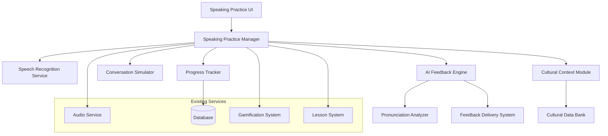

# Design Document: Advanced Speaking Practice with AI Feedback System

## Overview

The Advanced Speaking Practice with AI Feedback System transforms PREET_ENGLISH's speaking practice from a basic "record and forget" experience into an intelligent, culturally-aware, and pedagogically effective learning tool. This system leverages existing Web Speech APIs while adding sophisticated analysis, cultural context, and personalized feedback specifically designed for Hindi speakers learning English.

The system integrates seamlessly with the existing lesson structure, progress tracking, and gamification features while introducing new capabilities for real-time pronunciation analysis, conversation simulation, and culturally relevant practice scenarios.

## Architecture

### High-Level Architecture



### Component Integration

The system builds upon existing PREET_ENGLISH infrastructure:

- **Speech Recognition Service**: Enhanced version of existing `speechRecognition.ts`
- **Audio Service**: Leverages existing `audioService.ts` for TTS
- **Progress Tracking**: Integrates with existing `use-progress.ts` hook
- **Database**: Extends existing schema with new speaking-specific tables
- **Gamification**: Connects to existing XP and achievement systems

## Components and Interfaces

### 1. Enhanced Speech Recognition Service

```typescript
interface EnhancedSpeechRecognitionService {
  // Core recognition
  startListening(config: SpeechConfig): Promise<void>;
  stopListening(): void;
  
  // Advanced analysis
  analyzePhonemes(transcript: string, expected: string): PhonemeAnalysis;
  detectCommonErrors(transcript: string): HindiSpeakerError[];
  calculateFluencyMetrics(audioData: AudioBuffer): FluencyMetrics;
  
  // Cultural awareness
  validateIndianEnglish(transcript: string): ValidationResult;
  suggestInternationalAlternatives(text: string): Alternative[];
}

interface SpeechConfig {
  language: 'en-US' | 'en-IN';
  culturalMode: 'strict' | 'accepting' | 'teaching';
  difficultyLevel: 'beginner' | 'intermediate' | 'advanced';
  focusAreas: PronunciationFocus[];
}

interface PhonemeAnalysis {
  accuracy: number;
  problematicPhonemes: PhonemeError[];
  suggestions: PronunciationTip[];
}

interface HindiSpeakerError {
  type: 'th_substitution' | 'v_w_confusion' | 'r_pronunciation' | 'stress_pattern';
  detected: string;
  expected: string;
  hindiExplanation: string;
  practiceWords: string[];
}
```

### 2. AI Feedback Engine

```typescript
interface AIFeedbackEngine {
  // Core feedback generation
  generateFeedback(analysis: SpeechAnalysis): FeedbackResponse;
  createPersonalizedTips(userProfile: UserSpeakingProfile): PronunciationTip[];
  
  // Progress analysis
  trackImprovement(userId: number, sessionData: SpeakingSession): ProgressUpdate;
  identifyWeakAreas(userId: number): WeakArea[];
  
  // Cultural coaching
  provideCulturalGuidance(context: ConversationContext): CulturalTip;
}

interface FeedbackResponse {
  overallScore: number;
  pronunciation: PronunciationFeedback;
  fluency: FluencyFeedback;
  culturalNotes: CulturalNote[];
  nextSteps: ActionableStep[];
  encouragement: EncouragementMessage;
}

interface PronunciationFeedback {
  accuracy: number;
  specificIssues: PronunciationIssue[];
  improvements: string[];
  audioExamples: AudioExample[];
}

interface CulturalNote {
  type: 'business_context' | 'social_context' | 'regional_variation';
  message: string;
  hindiExplanation: string;
  examples: string[];
}
```

### 3. Conversation Simulator

```typescript
interface ConversationSimulator {
  // Scenario management
  loadScenario(scenarioId: number): ConversationScenario;
  generateResponse(userInput: string, context: ConversationContext): AIResponse;
  
  // Dynamic adaptation
  adjustDifficulty(userPerformance: PerformanceMetrics): void;
  introduceNewVocabulary(context: ConversationContext): VocabularyIntroduction;
  
  // Cultural scenarios
  getIndianContextScenarios(): ConversationScenario[];
  simulateBusinessMeeting(): BusinessScenario;
  simulateCasualConversation(): CasualScenario;
}

interface ConversationScenario {
  id: number;
  title: string;
  hindiTitle: string;
  context: string;
  userRole: string;
  partnerRole: string;
  difficulty: 'beginner' | 'intermediate' | 'advanced';
  vocabulary: VocabularyItem[];
  culturalTips: CulturalTip[];
  expectedDuration: number;
}

interface AIResponse {
  text: string;
  hindiTranslation?: string;
  emotion: 'neutral' | 'encouraging' | 'questioning' | 'surprised';
  followUpQuestions: string[];
  vocabularyHighlights: VocabularyHighlight[];
}
```

### 4. Cultural Context Module

```typescript
interface CulturalContextModule {
  // Context provision
  getContextForScenario(scenario: string): CulturalContext;
  explainCulturalDifference(situation: string): CulturalExplanation;
  
  // Indian English support
  validateIndianEnglishUsage(text: string): ValidationResult;
  suggestFormalAlternatives(casualText: string): FormalAlternative[];
  
  // Regional awareness
  adaptForRegion(content: string, region: IndianRegion): AdaptedContent;
}

interface CulturalContext {
  scenario: string;
  appropriateLanguage: LanguageLevel;
  commonMistakes: string[];
  culturalNuances: string[];
  hindiExplanations: string[];
}

interface CulturalExplanation {
  difference: string;
  hindiContext: string;
  englishContext: string;
  examples: ComparisonExample[];
  tips: string[];
}
```

## Data Models

### Speaking Practice Tables

```sql
-- Speaking Sessions
CREATE TABLE speaking_sessions (
  id INTEGER PRIMARY KEY AUTOINCREMENT,
  user_id INTEGER REFERENCES users(id) NOT NULL,
  lesson_id INTEGER REFERENCES lessons(id),
  scenario_id INTEGER REFERENCES scenarios(id),
  session_type TEXT NOT NULL, -- 'pronunciation', 'conversation', 'free_practice'
  duration_seconds INTEGER NOT NULL,
  overall_score INTEGER, -- 0-100
  pronunciation_score INTEGER,
  fluency_score INTEGER,
  confidence_score INTEGER,
  created_at TEXT DEFAULT CURRENT_TIMESTAMP,
  completed_at TEXT
);

-- Speaking Attempts (individual recordings within a session)
CREATE TABLE speaking_attempts (
  id INTEGER PRIMARY KEY AUTOINCREMENT,
  session_id INTEGER REFERENCES speaking_sessions(id) NOT NULL,
  expected_text TEXT,
  spoken_text TEXT NOT NULL,
  accuracy_score INTEGER NOT NULL,
  pronunciation_issues TEXT, -- JSON array of issues
  feedback_data TEXT, -- JSON feedback object
  audio_duration_ms INTEGER,
  attempt_number INTEGER NOT NULL,
  created_at TEXT DEFAULT CURRENT_TIMESTAMP
);

-- User Speaking Profiles
CREATE TABLE user_speaking_profiles (
  id INTEGER PRIMARY KEY AUTOINCREMENT,
  user_id INTEGER REFERENCES users(id) NOT NULL UNIQUE,
  current_level TEXT NOT NULL DEFAULT 'beginner',
  weak_phonemes TEXT, -- JSON array of problematic sounds
  strong_areas TEXT, -- JSON array of strengths
  preferred_practice_type TEXT DEFAULT 'mixed',
  cultural_context_preference TEXT DEFAULT 'indian_english',
  total_practice_minutes INTEGER DEFAULT 0,
  last_assessment_date TEXT,
  improvement_rate REAL DEFAULT 0.0,
  created_at TEXT DEFAULT CURRENT_TIMESTAMP,
  updated_at TEXT DEFAULT CURRENT_TIMESTAMP
);

-- Pronunciation Progress Tracking
CREATE TABLE pronunciation_progress (
  id INTEGER PRIMARY KEY AUTOINCREMENT,
  user_id INTEGER REFERENCES users(id) NOT NULL,
  phoneme TEXT NOT NULL, -- 'th', 'v', 'w', 'r', etc.
  accuracy_history TEXT, -- JSON array of scores over time
  practice_count INTEGER DEFAULT 0,
  last_practiced TEXT,
  mastery_level TEXT DEFAULT 'learning', -- 'learning', 'practicing', 'mastered'
  created_at TEXT DEFAULT CURRENT_TIMESTAMP
);

-- Cultural Scenario Progress
CREATE TABLE cultural_scenario_progress (
  id INTEGER PRIMARY KEY AUTOINCREMENT,
  user_id INTEGER REFERENCES users(id) NOT NULL,
  scenario_type TEXT NOT NULL, -- 'business_meeting', 'doctor_visit', etc.
  completion_count INTEGER DEFAULT 0,
  best_score INTEGER DEFAULT 0,
  confidence_level INTEGER DEFAULT 50, -- 0-100
  last_practiced TEXT,
  notes TEXT -- User or system notes about progress
);
```

### Enhanced Existing Tables

```sql
-- Add speaking-related fields to existing tables
ALTER TABLE lessons ADD COLUMN speaking_exercises TEXT; -- JSON array of speaking exercises
ALTER TABLE vocabulary ADD COLUMN pronunciation_difficulty INTEGER DEFAULT 1; -- 1-5 scale
ALTER TABLE vocabulary ADD COLUMN common_mispronunciation TEXT; -- How Hindi speakers typically mispronounce
ALTER TABLE user_stats ADD COLUMN speaking_minutes INTEGER DEFAULT 0;
ALTER TABLE user_stats ADD COLUMN pronunciation_accuracy_avg INTEGER DEFAULT 0;
```

## Correctness Properties

*A property is a characteristic or behavior that should hold true across all valid executions of a system—essentially, a formal statement about what the system should do. Properties serve as the bridge between human-readable specifications and machine-verifiable correctness guarantees.*

Let me analyze the acceptance criteria to determine which are testable as properties:

<function_calls>
<invoke name="prework">
<parameter name="featureName">speaking-practice-ai-feedback

## Correctness Properties

*A property is a characteristic or behavior that should hold true across all valid executions of a system—essentially, a formal statement about what the system should do. Properties serve as the bridge between human-readable specifications and machine-verifiable correctness guarantees.*

Based on the prework analysis, I've identified properties that can be automatically tested. After reviewing for redundancy, here are the consolidated correctness properties:

### Property 1: Speech Processing Performance
*For any* audio input, speech recognition and analysis should complete within the specified time limits (2 seconds for recognition, 3 seconds for full analysis)
**Validates: Requirements 1.1, 5.3**

### Property 2: Feedback Structure Completeness
*For any* pronunciation analysis, the feedback should contain all required components: accuracy scores, specific issues, Hindi explanations, English translations, and audio examples
**Validates: Requirements 1.2, 1.4, 6.1**

### Property 3: Hindi Speaker Error Detection
*For any* audio input containing known Hindi speaker pronunciation patterns (th/d, v/w, etc.), the system should correctly identify and categorize these specific error types
**Validates: Requirements 1.3**

### Property 4: Improvement Tracking Consistency
*For any* sequence of repeated pronunciation attempts with improving accuracy scores, the system should track improvement and provide increasingly positive feedback
**Validates: Requirements 1.5**

### Property 5: Cultural Context Availability
*For any* conversation practice selection, the available scenarios should include culturally relevant Indian contexts and business scenarios for appropriate difficulty levels
**Validates: Requirements 2.1, 2.5**

### Property 6: Cultural Error Correction
*For any* input containing known cultural communication mistakes, the system should provide gentle corrections with cultural nuance explanations
**Validates: Requirements 2.3**

### Property 7: Indian English Recognition
*For any* input containing valid Indian English variations, the system should recognize them as acceptable while offering international alternatives
**Validates: Requirements 2.4**

### Property 8: User Assessment Initialization
*For any* new user starting speaking practice, the system should trigger an assessment process to determine their speaking level
**Validates: Requirements 3.1**

### Property 9: Adaptive Difficulty Adjustment
*For any* user performance data, the system should adjust exercise difficulty appropriately - increasing for consistent success, providing targeted practice for struggles
**Validates: Requirements 3.2, 3.3, 3.4**

### Property 10: Progress-Based Unlocking
*For any* progress milestone achievement, the system should update user profiles and unlock appropriate new content or conversation topics
**Validates: Requirements 3.5, 7.3**

### Property 11: Session Data Recording
*For any* completed speaking session, all required metrics should be recorded: pronunciation accuracy, fluency scores, vocabulary usage, and session metadata
**Validates: Requirements 4.1**

### Property 12: Progress Report Generation
*For any* weekly progress calculation, the generated report should contain improvement trends, visual elements, and bilingual content
**Validates: Requirements 4.2**

### Property 13: Personalized Recommendation Creation
*For any* identified pronunciation challenges or weak areas, the system should generate personalized practice recommendations targeting those specific issues
**Validates: Requirements 4.3**

### Property 14: Milestone Celebration
*For any* achieved milestone, the system should trigger culturally appropriate celebration with encouragement and badge rewards
**Validates: Requirements 4.4**

### Property 15: Detailed Analysis Availability
*For any* request for detailed analysis, the system should provide phoneme-level breakdown and native speaker pattern comparisons
**Validates: Requirements 4.5**

### Property 16: Offline Functionality Preservation
*For any* offline usage scenario, basic pronunciation feedback should remain available using cached models
**Validates: Requirements 5.1**

### Property 17: Data Synchronization Consistency
*For any* transition from offline to online connectivity, all offline practice data should sync correctly and update progress analytics
**Validates: Requirements 5.2**

### Property 18: Storage Management Efficiency
*For any* limited storage scenario, the system should efficiently manage cached models and user data without losing core functionality
**Validates: Requirements 5.4**

### Property 19: Graceful Network Degradation
*For any* slow network conditions, the system should maintain core functionality while gracefully degrading advanced features
**Validates: Requirements 5.5**

### Property 20: Bilingual Feedback Consistency
*For any* feedback, pronunciation tips, or cultural context provided, the content should include both Hindi and English components with appropriate phonetic comparisons
**Validates: Requirements 6.1, 6.2, 6.3**

### Property 21: Error Message Localization
*For any* error condition, the displayed messages should be in Hindi with clear, actionable next steps
**Validates: Requirements 6.4**

### Property 22: Technical Term Translation
*For any* technical terms used in the interface or feedback, Hindi equivalents or simple explanations should be provided
**Validates: Requirements 6.5**

### Property 23: Lesson Integration Consistency
*For any* lesson completion or vocabulary learning, the speaking practice system should suggest relevant exercises and incorporate learned content into scenarios
**Validates: Requirements 7.1, 7.2, 7.4, 7.5**

## Error Handling

### Speech Recognition Errors
- **Microphone Access Denied**: Graceful fallback to text-based practice with clear Hindi instructions
- **Network Connectivity Issues**: Offline mode activation with cached pronunciation models
- **Audio Quality Problems**: Automatic noise filtering and user guidance for better recording conditions
- **Browser Compatibility**: Progressive enhancement with feature detection and alternative input methods

### AI Analysis Errors
- **Processing Timeouts**: Fallback to basic accuracy scoring with retry options
- **Model Loading Failures**: Graceful degradation to simpler analysis with user notification
- **Cultural Context Unavailable**: Default to general English feedback with notification

### Data Persistence Errors
- **Storage Quota Exceeded**: Intelligent cache management with user notification and cleanup options
- **Sync Failures**: Retry mechanisms with exponential backoff and user status updates
- **Progress Loss**: Automatic backup strategies and recovery mechanisms

## Testing Strategy

### Dual Testing Approach

The system requires both **unit tests** and **property-based tests** for comprehensive coverage:

**Unit Tests** focus on:
- Specific pronunciation error detection examples
- Cultural scenario edge cases
- Integration points between components
- Error handling and recovery scenarios
- UI component behavior and accessibility

**Property-Based Tests** focus on:
- Universal properties across all user inputs and scenarios
- Performance characteristics under varying conditions
- Data consistency and synchronization behavior
- Comprehensive input coverage through randomization

### Property-Based Testing Configuration

- **Testing Framework**: fast-check for TypeScript/JavaScript property-based testing
- **Minimum Iterations**: 100 iterations per property test
- **Test Tagging**: Each property test tagged with format: **Feature: speaking-practice-ai-feedback, Property {number}: {property_text}**
- **Data Generation**: Smart generators for audio data, user profiles, pronunciation patterns, and cultural scenarios

### Integration Testing

- **Cross-Component Testing**: Verify seamless integration between speech recognition, AI feedback, and progress tracking
- **Performance Testing**: Validate response times under various device and network conditions
- **Cultural Accuracy Testing**: Verify cultural context and Hindi translations with native speaker validation
- **Accessibility Testing**: Ensure compatibility with screen readers and assistive technologies

### User Acceptance Testing

- **Hindi Speaker Validation**: Testing with native Hindi speakers across different English proficiency levels
- **Cultural Appropriateness Review**: Validation of cultural scenarios and feedback by cultural experts
- **Device Compatibility Testing**: Testing across Android devices common in the Indian market
- **Network Condition Testing**: Validation under typical Indian internet connectivity scenarios